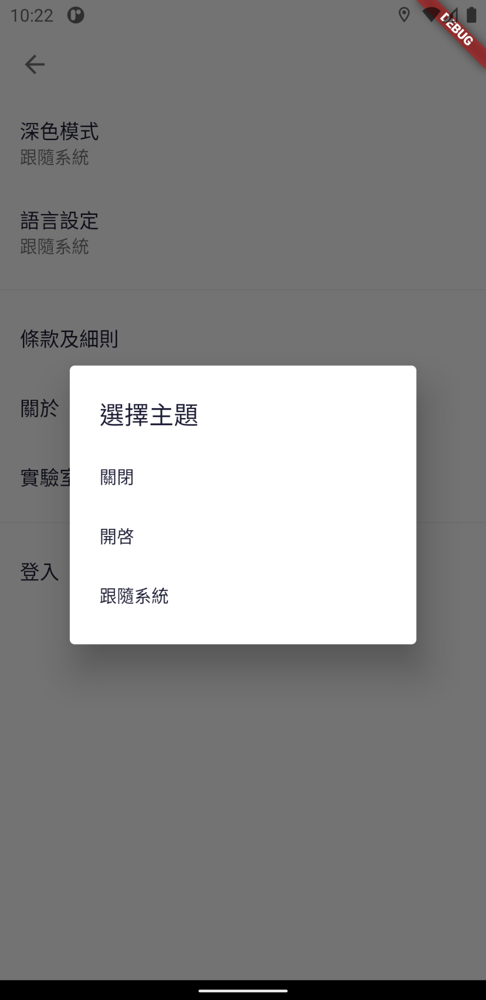

Hong Kong Institute of Vocational Education (Sha Tin)

Department of Information Technology Higher Diploma in AI & Mobile Applications Development

ITE4106M Final Year Project (2020-2021)

Project Title: Artificial Intelligence Applications in Park Management

**Final Report**

| **Project ID: 2021-114118-07** |                               |                                      |
|--------------------------------|-------------------------------|--------------------------------------|
| **Class**                      | IT114118-2A                   |                                      |
| **Leader**                     | 190008151                     | Lee Chak Kei                         |
| **Member**                     | 190194809 190004397 190022089 | YUEN Yik Chun Lung Pui Man Chan Kian |
| **Teacher**                    | Vincent Liu                   |                                      |
| **Date**                       | 05/07/2021                    |                                      |
| **Version**                    |                               |                                      |

Contents

[Acknowledgment](#_Toc71323589)

[Abstract](#_Toc71323590)

[Introduction](#_Toc71323591)

[Introduction](#introduction-1)

[The problem](#the-problem)

[The requirements](#the-requirements)

[Documentation for problem analysis](#documentation-for-problem-analysis)

[The problem](#_Toc71323596)

[Greening Hong Kong Policy](#_Toc71323597)

[Arboriculturally and Park Management Project by Hotel Discipline](#_Toc71323598)

[Feasibility Study in Leave Recognition Using AI](#feasibility-study-in-leave-recognition-using-ai)

[The requirements](#_Toc71323600)

[Scope of The Proposed System](#scope-of-the-proposed-system)

[Description of functions provided](#_Toc71323602)

[Documentation for problem analysis](#_Toc71323603)

[Software Process model](#software-process-model)

[Use case descriptions & use case diagram](#use-case-descriptions--use-case-diagram)

[Context Diagram](#context-diagram)

[Level 0 of DFD](#level-0-of-dfd)

[Level 1 - Manage Leaf Information](#level-1---manage-leaf-information)

[Flora Level 1 - Manage User Account](#flora-level-1---manage-user-account)

[Flora Level 1 - Training Leaf AI](#flora-level-1---training-leaf-ai)

[Class Diagram](#class-diagram)

[State Transition](#state-transition)

[Sign up](#_Toc71323613)

[Documentation for detailed design](#_Toc71323614)

[Software/Hardware architectural design](#softwarehardware-architectural-design)

[UX & UI design](#ux--ui-design)

[UI design (original)](#ui-design-original)

[Project platform (software/hardware)](#_Toc71323618)

[Programming Language](#programming-language)

[Software](#software)

[Hardware](#hardware)

[Implementation](#_Toc71323622)

[Record of the implementation work](#record-of-the-implementation-work)

[Original Project plan](#original-project-plan)

[Work Distribution (Tentative)](#work-distribution-tentative)

[Progress Report](#progress-report)

[Test plan result](#_Toc71323627)

[Critical evaluation](#_Toc71323628)

[Results and conclusions](#_Toc71323629)

[Problem/difficulties encountered](#problemdifficulties-encountered)

[Quality of implementation](#_Toc71323631)

[Conclusions](#conclusions)

[References](#_Toc71323633)

We declare that this is a group project and that no part of this submission has been copied from any other student’s work or from any other source except where due acknowledgment is made explicitly in the text, nor has any part been written for us by another person.

| **Student**   | **Contribution to the project (%)**  **(Total 100%)** |
|---------------|-------------------------------------------------------|
| Lee Chak Kei  | 25%                                                   |
| Yuen Yik Chun | 25%                                                   |
| Lung Pui Man  | 25%                                                   |
| Chan Kian     | 25%                                                   |

# Acknowledgment

The project team would like to express our great appreciation to Mr. KWOK Yu Ho and Ms. Catherine Cheung for their patient guidance, enthusiastic encouragement and helpful critiques of the project, and advice and assistance in keeping the progress on schedule.

We would also like to extend our thanks to the Department of Hospitality, IVE(CW), for their help in offering us the resources in running the program.

# Abstract

Do you know what kind of tree is living behind you or what type of plant is suitable to grow in your environment?

Now, we are going to design an application (code name Flora) that will help you to learn more about trees. As an educational app, it can identify and locate plants around you. To help you to understand and improve your environment.

# Introduction

The purpose of this report is to assess the green environment problem and propose some solutions accounting for the problems which are mentioned in this report. This report will cover the background of the problem, an outline of the solution, the project planning, the project platform to be used, and the significance of the project. Finally, a summary of this report and references will be included. The details of each part will be shown below.

## **Introduction**

A general description of document structure, the project and its background.

## **The problem**

Describes the excessive environment problem.

## **The requirements**

Scope of the proposed system, description of functions provided and data processed by the system, other non-functional requirements, such as interface with existing system(s).

## **Documentation for problem analysis**

Data model (e.g. ERD or class diagram), functional model (e.g. DFD + use cases + use case descriptions), state transition diagram, sequence diagram.

**Documentation for detailed design**

Data design, software/hardware architectural design (system design), procedural design (module), user interface design, project platform (software/hardware)

**Implementation**

Record of the implementation work, e.g. test plan, test results, changes to design, critical evaluation and justification of changes.

**Results and conclusions**

A summary and a critical discussion of the results, conclusions, any problems/difficulties encountered, limitations of the proposed system, and in some cases a subsection suggesting further developments to be undertaken.

# The problem

Hong Kong is a beautiful city. Greening plays an important role in building an environmentally friendly society. The Government of HKSAR is striving to uplift the quality of living through active planting. And hence, there are many parks. The clubhouse of the private estate is even furnished with arboriculture decor. Especially, citizens may not know well about what kind of plants is suitable to grow for their environment or what type of leaf. Therefore, we came up with the idea to build an application that can identify leaves. Let the user understand the characteristics and the grow method of the leaf. Also, it can help the gardener choose suitable plants to grow. Most users can use the application to learn about the leaf. So, we hope the application can contribute to the green environment.

## Greening Hong Kong Policy

The Hong Kong Government is striving to uplift our living environment’s quality through active planting, proper maintenance, and preservation of trees together with other vegetation. To achieve the policy targets, the Government has developed strategies that aim to improve the coordination and effectiveness of greening efforts within the current regime and make greening an integral part of future public works projects. The Greening, Landscape and Tree Management (GLTM) Section was established under the Works Branch of Development Bureau in March 2010 to champion a new and strategic policy on greening, landscaping, and tree management, with a view to achieving sustainable development of a greener environment for Hong Kong.

Since Hong Kong is a densely populated city where trees and shrubs provide freshness, beauty, comfort, and elegance for our enjoyment, it can improve urban living conditions and enhance the quality of our lives. The government's greening work is characterized by the great variety and spatial distribution across the territory, ranging from extensive and ecological planting in the countryside to thematic and diversified planting in the urban and fringe areas. Over six million trees planted in the past ten years. This greening work is realized through the concerted efforts of different Government departments.

## Arboriculturally and Park Management Project by Hotel Discipline

To raise the general public's awareness of a greener livelihood, the Department of Hospitality, IVE(CW), has proposed the Arboriculturally and Park Management Project to the team. The project aims to let the citizens understand the characteristics of the plants which grow nearby their environment. After the meeting, they decided to make a mobile application that builds with some key functions, such as leaves recognition, trees searching, and trees positioning in the application.

A survey about the understanding of Greening Hong Kong urban area which was resulted in 86% of respondents and reflected that greening city is a necessity. There have been many incidents of tree fall in the past. 75% of respondents show that they are willing to spend money on research and development of technology for tree conservation. 80% of respondents claimed they were interested in understanding the characteristics of the plants. Furthermore, 95% of respondents stated that the risk of trees falling in Hong Kong is high because of health problems and not enough conservation. In addition, planting with proper care and conservation is important to improve the quality of the urban environment. The current goal is to increase the green area in the urban, beautify the existing greening area, and consider the characteristics of planting tree species when planning and developing public works projects, planting them with sustainable development strategies, and improving high-quality greening opportunities.

## Feasibility Study in Leave Recognition Using AI

To make robust and accurate leaf recognition features, the team conducted a feasibility study on employing Artificial Intelligence (AI) on leaf recognition. Nowadays, AI is an advanced and popular technology in the industry. In this project, the team would like to build leaves recognition to make use of AI. The team will make use of the samples that are provided by the organization to build up the model. Using machine learning (ML), to let Tensorflow to train the data. The system will compare the bunch of sample data to find out the characteristic.

Leaf recognition using AI is one of the big challenges in this project. The challenge is that the recognition function cannot provide an accurate result to the user. If the system cannot provide an accurate result to the user, it will affect user experience. There are two possible situations that will cause this problem. One of the situations is the samples that provided to the system for ML are not enough. Tensorflow fails to train an AI model which can identify the characteristics. To solve this problem, the team needs to add more and more samples to the system for ML to train an AI model with lower deviation. Another situation is the user provides a bad image to the system for the recognition. If the user's equipment (especially the photography system) cannot provide a clear image to the system. The image is blurry or it is with bad color correction. The system cannot or is difficult to identify the characteristics so it cannot provide an accurate result to the user. To solve this problem, the user should follow the user guide correctly to avoid this problem.

# The requirements

## Scope of The Proposed System

To solve the problem of excessive consumption and create a mobile application that matches the users' needs, the team will design an application that

• An intuitional and easy to use user interface

• No advertising

• Support languages

Moreover, the team will also provide such functions to the user such as

• Searching - Search the plant that the user is interested in.

• Locating - Show various tree locations.

• Recognition - Recognise different kinds of leaves.

• News - Show the latest Information or useful tips.

• AI Retraining - Retrain AI model.

## Description of functions provided

**1. Searching function**

The app should allow the user to search for the tree information by providing the tree name.

**2. Locating function**

The app should allow the user to browse various tree locations.

**3. Recognition function**

The app should allow the user to recognize the leaf for the information of the leaf that comes from which kind of the tree by providing an image for the leaf.

**4. News**

The app will show the latest information or useful tips on Home Page.

**5. AI Retraining**

Admininstor can retrain AI model by providing new datasets.

# Documentation for problem analysis

## Software Process model

The Waterfall Method will be used to analyse system requirements. There are five stages shown below.

-   **Requirement analysis and definition**

collecting all possible requirements of the system and finding the functions and information requirements of the system.

-   **System design**

confirming the system requirement and simplified the system structure to ensure that the easy minuteness works in the future and the lower workload of the developer. Also, our team will determine the functions that we need.

-   **Implementation**

Our team is using google dart and flutter to develop the application.

-   **Testing**

In this stage, our team will develop a test plan that defines a series of tests for finding the faults and failures.

-   **Maintenance**

when the system is released, the system might have some issues, our team will update and fix them immediately. also, some better versions will be released to enhance the product.

## Use case descriptions & use case diagram

|   | Actor name      | Description                                                      |
|---|-----------------|------------------------------------------------------------------|
| 1 | Administer user | Administer user is a user which has an administrative right.     |
| 2 | General user    | A general user is a user who is willing and able to use the app. |

| Use case name:  | Browning Tree information                                     |
|-----------------|---------------------------------------------------------------|
| Use case ID:    | UC - 100                                                      |
| Actor(s):       | Administer user, General user                                 |
| Description:    | Browsing the tree information that the user is interested in. |

| Use case name:  | Searching Tree                                                                                              |
|-----------------|-------------------------------------------------------------------------------------------------------------|
| Use case ID:    | UC - 200                                                                                                    |
| Actor(s):       | Administer user, General user                                                                               |
| Description:    | Users can type the keyword in the search bar for searching tree information that the user is interested in. |

| Use case name:  | Browning Tree Location                                                             |
|-----------------|------------------------------------------------------------------------------------|
| Use case ID:    | UC - 300                                                                           |
| Actor(s):       | Administer user, General user                                                      |
| Description:    | Browsing the tree location information in Mac view that the user is interested in. |

| Use case name:  | Add/Edit/Delete Tree Data            |
|-----------------|--------------------------------------|
| Use case ID:    | UC - 310                             |
| Actor(s):       | Administer user                      |
| Description:    | Add, Edit, and Delete the tree data. |

| Use case name:  | Browning News                                   |
|-----------------|-------------------------------------------------|
| Use case ID:    | UC - 400                                        |
| Actor(s):       | Administer user, General user                   |
| Description:    | Browsing the latest news and some useful types. |

| Use case name:  | Add/Edit/Delete News Data            |
|-----------------|--------------------------------------|
| Use case ID:    | UC - 410                             |
| Actor(s):       | Administer user, Normal user         |
| Description:    | Add, Edit, and Delete the news data. |

| Use case name:  | Leaf Recognition                                                                                                                  |
|-----------------|-----------------------------------------------------------------------------------------------------------------------------------|
| Use case ID:    | UC - 500                                                                                                                          |
| Actor(s):       | Administer user, Normal user                                                                                                      |
| Description:    | Users can find the type of the plant by taking an image or selecting an image in the filesystem to the system AI for recognition. |

| Use case name:  | AI Retraining                          |
|-----------------|----------------------------------------|
| Use case ID:    | UC - 600                               |
| Actor(s):       | Administer user                        |
| Description:    | Retraining the AI for higher accuracy. |

## Context Diagram

## Level 0 of DFD

## Level 1 - Manage Leaf Information

## Flora Level 1 - Manage User Account

## Flora Level 1 - Training Leaf AI

## Class Diagram

## State Transition

## **Sign up**

**Sign in**

**AI Analyse**

**Sequence diagram**

Tree recognise

# Documentation for detailed design

## Software/Hardware architectural design

Modular Design

The system is using modular design, it is a design principle that subdivides a system into smaller parts called modules or blocks which can be independently created, modified, replaced, or exchanged with other modules or between different systems.

Two-Tier Client-Server Architecture

On the server-side, Flutter calls the backend via rest-API to perform different operational control, database processes, and AI service. On the client-side, the application focuses on presentation and AI image capture. Clients can communicate with the server via the Internet.

## UX & UI design

| Launch Screen                                   |   |
|-------------------------------------------------|---|
|  |   |

| Introduction Screen                             | Introduction Screen 2                           |
|-------------------------------------------------|-------------------------------------------------|
|  |  |

| Sign Up                                         | Forgot password                                 |
|-------------------------------------------------|-------------------------------------------------|
|  |  |

| Login                                           | terms                                           |
|-------------------------------------------------|-------------------------------------------------|
|  |  |

| Home Page                                       | Home Page (dark)                                |
|-------------------------------------------------|-------------------------------------------------|
|  |  |

| Search page (CHI)                               | Search page (ENG)                               |
|-------------------------------------------------|-------------------------------------------------|
|  |  |

| Detail page (CHI)                               | Detail page (ENG)                               |
|-------------------------------------------------|-------------------------------------------------|
|  |  |

| Map (permission)                                | Map                                             |
|-------------------------------------------------|-------------------------------------------------|
|  |  |

| Profile                                         | Search page (reload)                            |
|-------------------------------------------------|-------------------------------------------------|
|  |  |

| Language                                        | Theme                                           |
|-------------------------------------------------|-------------------------------------------------|
|  |  |

| Setting                                         | AI Result                                       |
|-------------------------------------------------|-------------------------------------------------|
|  |  |

| Image viewer                                    |
|-------------------------------------------------|
|  |

## UI design (original)

About the user interface, the team would like to design the user interface by ourselves since it could be higher controllability and compatibility. We would like the user interface to look fresh and clean, so we choose to use a minimalist design that uses different leaves as the background, the lines as the classification. Hope the user uses the application simply and easily.

Since it is an application about the green environment, green is the main color. Refer to the leaf, petiole, and stipule, the color is selected from dark green to light green.

On the map page, the icon showing landmarks has been redesigned. It is built-in green Jewelry.

In the detail page of the plant, since we got a lot of information to show on the screen, we use different types of format such as a table, list view, bold font, and font size.

About the UI logo, it is a curve-based design. The size and format are all based on iOS standard 1024x1024. For the process, refer to the different kinds of methods for drawing trees and leaves. We hope that the logo can be used to express the theme concept. The logo uses Adobe Ai drawing and the fine modification in Figma.

# Project platform (software/hardware)

## Programming Language

**Google Dart**

Dart is a client-optimized programming language for apps on multiple platforms. It is developed by Google and is used to build mobile, desktop, server, and web applications.

Dart is an object-oriented, class-based, garbage-collected language with C-style syntax. Dart can compile to either native code or JavaScript. It supports interfaces, mixins, abstract classes, reified generics, and type inference.

Reason for choosing this programming language:

Google Dart is the developed programming language because the team chose to use Google Flutter to develop our application.

## Software

**Flutter**

Flutter is an open-source UI software development kit created by Google. It is used to develop applications for Android, iOS, Linux, Mac, Windows, Google Fuchsia, and the web from a single codebase.

Reason for choosing this software:

It can develop applications compatible with iOS and Android platforms since both platforms are popular.

**Android Studio**

Android Studio is the official integrated development environment (IDE) for Android platform development. Reason for choosing this software: The team is going to edit the java and XML in the Android Studio. And then there is some equipment to help the program developer to debug and test in the console and emulator respectively.

Reason for choosing this software:

It is a useful development platform for debugging and testing the application. Also, it is an official IDE by Google.

**Microsoft Visual Studio Code**

Visual Studio Code is a free source-code editor made by Microsoft for Windows, Linux, and macOS. Features include support for debugging, syntax highlighting, intelligent code completion, snippets, code refactoring, and embedded Git. Users can change the theme, keyboard shortcuts, preferences, and install extensions that add additional functionality.

Reason for choosing this software:

It is a useful development platform for typing and debugs code.

**Docker**

Docker is a set of platforms as a service (PaaS) product that uses OS-level virtualization to deliver software in packages called containers. Containers are isolated from one another and bundle their own software, libraries, and configuration files; they can communicate with each other through well-defined channels. All containers are run by a single operating system kernel and therefore use fewer resources than virtual machines.

**Postman**

Postman is a collaboration platform for API development. Postman's features simplify each step of building an API and streamline collaboration.

Reason for choosing this software:

It is helpful to check the connection on the server.

**Django Rest Framework**

Django REST framework is a powerful and flexible toolkit for building Web APIs. Authentication policies including packages for OAuth1a and OAuth2.

Serialization that supports both ORM and non-ORM data sources. Customizable all the way down use regular function-based views if you don't need the more powerful features. Used and trusted by internationally recognized companies including Mozilla, Red Hat, Heroku, and Eventbrite.

Reason for choosing this software:

Compared to PHP, Django covers all the security loopholes of PHP, while PHP requires an experienced and skilful developer. Also, Django built-in feature-packed and batteries included framework. Therefore it makes building the backend part of the website convenient.

**GitHub**

GitHub is a code hosting platform for version control and collaboration. It lets you and others work together on projects from anywhere.

Reason for choosing this software:

The platform can let the team manage the application easily.

**TensorFlow**

TensorFlow is a free and open-source software library for machine learning. It can be used across a range of tasks but has a particular focus on training and inference of deep neural networks.

TensorFlow is a symbolic math library based on dataflow and differentiable programming. It is used for both research and production at Google.

Reason for choosing this software:

TensorFlow is an end-to-end platform that makes the team easy to build and deploy ML models.

**Nginx**

Nginx is a web server that can also be used as a reverse proxy, load balancer, mail proxy and HTTP cache. The software was created by Igor Sysoev and publicly released in 2004. Nginx is free and open-source software, released under the terms of the 2-clause BSD license. A large fraction of web servers uses NGINX often as a load balancer. Nginx can be deployed to serve dynamic HTTP content on the network using FastCGI, SCGI handlers for scripts, WSGI application servers or Phusion Passenger modules, and it can serve as a software load balancer.

**Gunicorn**

Gunicorn 'Green Unicorn' is a Python WSGI HTTP Server for UNIX. It is a pre-fork worker model. The Gunicorn server is broadly compatible with various web frameworks, simply implemented, light on server resources, and speedy.

## Hardware

**Computer**

A personal computer is the main instrument to develop the project.

**Smartphone**

A smartphone is required because we need to use the smartphone to test the application.

**Server**

A server is required because we need to hold a server to manage the information of the user and the plants. Also, we need to use the server to train the AI model for the recognition function.

# Implementation

## Record of the implementation work

| **Task Name**                                                                                                                     | **Start**  | **End**    | **Duration (days)** |
|-----------------------------------------------------------------------------------------------------------------------------------|------------|------------|---------------------|
| Discuss and set the project objective                                                                                             | 25/8/2020  | 10/9/2020  | 17                  |
| Complete and submit the Project Proposal                                                                                          | 11/9/2020  | 18/9/2020  | 8                   |
| Discuss with the Project Stakeholder and our Project Supervisors for suggestion and expectation National Day & Chinese Mid-Autumn | 19/9/2020  | 22/10/2020 | 34-2 32             |
| Complete and submit the Initial Report Chung Yeung Festival                                                                       | 23/9/2020  | 30/10/2020 | 8-1 7               |
| UI porting to application                                                                                                         | 1/11/2020  | 8/1/2021   | 73-12 61            |
| Test pre-trained model                                                                                                            |            |            |                     |
| Discuss with the Project Stakeholder                                                                                              |            |            |                     |
| Flora mobile app UI Design                                                                                                        |            |            |                     |
| Tensorflow Image Classification                                                                                                   |            |            |                     |
| Test backend get User data                                                                                                        |            |            |                     |
| Login / Register / Logout function                                                                                                |            |            |                     |
| Add Tree table data in backend                                                                                                    |            |            |                     |
| AI rest-api json request                                                                                                          |            |            |                     |
| Complete and submit the Interim Report                                                                                            |            |            |                     |
| Christmas Holidays                                                                                                                | 21/12/2020 | 1/1/2021   |                     |
| Exam Period                                                                                                                       | 4/1/2021   | 13/1/2021  |                     |
| Prepare demo                                                                                                                      | 14/1/2021  | 31/1/2021  | 18                  |
| Application function design and implementation                                                                                    | 1/2/2021   | 14/3/2021  | 42-6 36             |
| Lunar New Year                                                                                                                    | 11/2/2021  | 17/2/2021  |                     |
| Testing and debug                                                                                                                 | 15/3/2021  | 31/3/2021  | 17                  |
| Ching Ming Festival & Easter Holidays                                                                                             | 1/4/2021   | 6/4/2021   |                     |
| Final testing and Complete the Final Report                                                                                       | 7/4/2021   | 7/5/2021   | 31                  |

## Original Project plan

| Detail                                                       | SEP,20 | OCT,20 | NOV,20 | DEC,20 | JAN,21 | FEB,21 | MAR,21 | APR,21 | MAY,21 |
|--------------------------------------------------------------|--------|--------|--------|--------|--------|--------|--------|--------|--------|
| Project Proposal                                             |        |        |        |        |        |        |        |        |        |
| Initial Report                                               |        |        |        |        |        |        |        |        |        |
| Interim Report                                               |        |        |        |        |        |        |        |        |        |
| Prototype 1                                                  |        |        |        |        |        |        |        |        |        |
| Presentation and Demonstration (Prototype 1)                 |        |        |        |        |        |        |        |        |        |
| Prototype 2                                                  |        |        |        |        |        |        |        |        |        |
| Testing (Prototype 2)                                        |        |        |        |        |        |        |        |        |        |
| Progress Report and Mid-Semester Demonstration (Prototype 2) |        |        |        |        |        |        |        |        |        |
| Final Prototype                                              |        |        |        |        |        |        |        |        |        |
| Final Report                                                 |        |        |        |        |        |        |        |        |        |
| Final Testing                                                |        |        |        |        |        |        |        |        |        |
| Presentation (Final Version)                                 |        |        |        |        |        |        |        |        |        |

## Work Distribution (Tentative)

| Member  Work                      | Lee Chak Kei  | Yuen Yik Chun  | Lung Pui Man  | Chan Kian  |
|-----------------------------------|---------------|----------------|---------------|------------|
| Mobile Application Implementation | \*            |                |               |            |
| Website Implementation            |               | \*             |               |            |
| UI & UX Design                    |               |                | \*            |            |
| Hardware Support                  |               |                |               | \*         |
| Network Support                   |               | \*             |               |            |
| Document Writing                  |               |                |               | \*         |

\* = Major responsible for that part

## Progress Report

|  |
|-------------------------------------------------|

|  |
|-------------------------------------------------|

|  |
|-------------------------------------------------|

|  |
|-------------------------------------------------|

## Test plan result

| Test No.                 | Test                                 | Description                                                                               | Result  | Situation                             |
|--------------------------|--------------------------------------|-------------------------------------------------------------------------------------------|---------|---------------------------------------|
| Third-Party              |                                      |                                                                                           |         |                                       |
| GD01                     | Google drive                         |  Connection & data transection of data set(image) inside Google drive                     | Fail    | Server Timeout error.                 |
| Leaf detection AI Model  |                                      |                                                                                           |         |                                       |
| AI01                     | Leaf detection                       | Test the model with a test data set.                                                      | Pass    |                                       |
| React Native Flutter App |                                      |                                                                                           |         |                                       |
| AP01                     | Sign In                              | Test sign in function with different case                                                 | Pass    |                                       |
| AP02                     | Sign Up                              | Test sign up function with different case                                                 | Pass    |                                       |
| AP03                     | Collect Server Information           | Test collect data from the database server                                                | Pass    |                                       |
| AP04                     | Camera                               | Test pick an image and take photo function                                                | Pass    |                                       |
| AP06                     | Leaf Recognise                       | Send the image to the server and get the predict the result                               | Pass    |                                       |
| AP07                     | Card view                            | Test the card view can show the leaf information                                          | Pass    |                                       |
| AP08                     | Search Bar                           | Test typing keyword for search leaf information                                           | Pass    |                                       |
| AP09                     | Language conversion                  | Test the language conversion between the Chinese and English                              | Pass    |                                       |
| AP10                     | Map function                         | Test the tree location showing                                                            | Pass    |                                       |
| Web Application          |                                      |                                                                                           |         |                                       |
| WA01                     | Sign in                              | Test sign in function with different case                                                 | Pass    |                                       |
| WA02                     | Log out                              | Test log out function with different case                                                 | Pass    |                                       |
| WA03                     | Home screen                          | Test all data get from the database                                                       | Pass    |                                       |
| WA04                     | Account Management                   | Test management account data on the website                                               | Pass    |                                       |
| WA05                     | Leaf Management                      | Test the leaf information management to add or delete new leaf information on the website | Pass    |                                       |
| WA06                     | Profile Management Account           | Test view and edit profile function in website                                            | Pass    |                                       |
| WA07                     |  News Management                     | Test manages the news & tips information                                                  | Pass    |                                       |
| Server                   |                                      |                                                                                           |         |                                       |
| S01                      | Connection                           | Test the connection between server and application                                        | Warning | Problem/difficulties encountered Pt.6 |
| S02                      | AI-retrain with google drive dataset | Test the AI-retrain which is using the google drive dataset                               | Fail    | Server Timeout error.                 |
| S03                      | AI-retrain with local server dataset | Test the AI-retrain which is the local server dataset                                     | Pass    |                                       |

## Critical evaluation

About the project login function, it is finished and working. The login function is using the user email and password for login.

About the project AI function, the team did not build an AI model for the application since we lack time and AI processing power. We decided to transfer learning to solve the problem. We have chosen three pre-trained modes (EfficientNetB0, EfficientNetB3, Inception V3) for our application AI training. EfficientNet is proposed by Google in 2019, through Google AutoML technology, built eight efficient models, namely B0-B7. Inception is a classic architecture that was proposed by Google in 2014.

To find out which pre-trained model is suitable for our project, the team uses one type of the tree dataset to train the AI with the pre-trained model which we have chosen. The team uses one type of the tree dataset because we lack the resource of the leaf dataset. It is because of COVID-19, our partner cannot provide the dataset as soon as possible.

Finally, we choose the EfficientNetB3 for the application pre-trained model. The EfficientNetB3 model size is not big. Also, it can provide a powerful AI performance for image recognition.

About the project tree location, the function is not fully complete because due to the COVID-19, our partner cannot provide the tree location as soon as possible. However, we had prepared to set up the database to store the location data and the page which is for the application shows the location. After the team or the partner insert the data, the function will be ready for use.

# Results and conclusions

## Problem/difficulties encountered

1.  **Map function - Google map**

After following the official documentation to import the Google Maps plug-in and running it, the application crashed.

The teams are working hard to find a solution to fix it. In Flutter's GitHub issue page, we note that the command should add in the Gradle.properties.

android.enableDexingArtifactTransform=false

However, the problem still exists. This command solves the problem when we are testing on the debug mode. Using the release environment to run the application, the application crashes.

After research, we note that Google maps do not support the Flutter 4.0.0 and newer version (Gradle version).

Finally, overwrite the Gradle version to 3.6.2.

1.  **Searching function - Search bar & Soft keyboard**

The common design of the search bar is a navigator to a new search page for the searching.

When the user comes back to the last page, the dispose search page will active and the text field package will automatically hide the soft keyboard.

However, the Flora project did not adopt the above development idea because of the concern of user experience. The search bar with the text field package is directly built inside the main page. No new search page for the searching.

1.  **Searching function - Search bar & tree card**

In the early design, when the user clicks the tree card, the detail page will show up. To make it work, the program design to use the tree list index is the key for catching the corresponding model data.

At first, things were perfect and there was no problem because all the list builder is built by the tree JSON model sequence established and the list view index is corresponding to the tree JSON model list index. However, when we add the search bar, this becomes another story.

After adding the search bar, the search result is the list item index which is not corresponding to the tree model index. The detail page will show another set of data which is incorrect.

To solve the problem, the search bar will return the tree data directly for the application and get the correct tree data in the tree model.

1.  **Language conversion**

To make the application useful for Hong Kong citizens. The application will build the language conversion between Chinese and English. Server data is also available in Chinese and English. The user can switch between Chinese and English in the settings. The language of the application interface will change after the switch.

Ideally, all data within the application will change the corresponding language.

However, the stored data will not follow the language conversion setting immediately.

To solve the problem, users can pull down for the record update. This will call the API to obtain the data of the corresponding language.

1.  **Packages problem**

Many third-party packages are used during project development which we believe in can improve the efficiency of the development process and reduce the amount of code.

However, different packages will have their own requirement. For example, the analyzer version.

The json_serializable and built_value_generator are two packages which depend on different analyzer versions respectively. When the version conflicts, the build project will fail to pass the compiler.

To solve this problem, we need to be extra careful with the package version, and you should specify the version to avoid unnecessary trouble.

There is another method to solve the problem. Using dependency_overrides to force the conflicts. However, similar methods were not used in the development process because of concerns about unnecessary plug-in errors.

1.  **Network problem (Server)**

In the early design, the team would like to build a server for the application to run perfectly. In the testing and debug stage, we build a server in school for the testing. Unfortunately, we are facing a serious problem which is the network connection problem. The server is important for the Flora project because the most important function such as AI is using the server to achieve.

The teams are working hard to find out the problem. In the early investigation, we found that the server can work normally in our home network, but the school cannot. After contact with the school technician for further investigation, we find out the school’s firewall is blocking the server connection for security reasons. Also, the school technician cannot modify the firewall setting for us because of security reasons and the school policy.

To solve this problem, we need to redesign the server. However, the team does not have enough time to rebuild a server. We ask our supervisors for advice and we decide to add third-party servers which can pass through the school firewall for a successful connection.

## Quality of implementation

Now, you should have a clearer picture of Flora. Although the Flora cannot solve all the problems faced by gardeners, we believe it can promote the message that a green environment is important and it would become a useful tool for students, gardeners, researchers, and citizens to learn about the leaf.

Our project fulfills most of the early design requirements. Which included the searching function, locating function, recognition function, and language conversion between the Chinese and English. Also, the team adds more useful functions such as news with useful tips and AI retraining.

For the implementation, the application may add the favorites function which is helpful for the user to save the tree record which the user is interested in.

## Conclusions

In conclusion, the project was mostly successful since the team can fulfill most of the early design requirements. There were several unknown elements at the start of the project which meant that it had a certain element of risk. These included our team choosing Google Flutter to develop the application which we never used before. Since we lack expernment and knowledge of react native framework, we need to spend more time on programming than other groups. Also, we are facing some unexpected difficulties such as the school's firewall is blocking the server connection because of security reasons. However, most of these potential problems were successfully overcome. The react native framework can run fluently with a nice user interface.

# References

*About GLTMS Purpose and Objectives* https://www.greening.gov.hk/en/about_gltms/purpose_objectives.html

*Planting Record* https://www.greening.gov.hk/en/people_trees_harmony/planting_record.html

*Google Dart*

https://en.wikipedia.org/wiki/Dart_(programming_language)

*Flutter*

https://en.wikipedia.org/wiki/Flutter_(software)

*Android Studio*

https://en.wikipedia.org/wiki/Android_Studio

*Microsoft Visual Studio Code*

https://en.wikipedia.org/wiki/Visual_Studio_Code

*Docker*

https://en.wikipedia.org/wiki/Docker_(software)

*Microsoft Azure*

https://en.wikipedia.org/wiki/Microsoft_Azure

*PostgreSQL*

https://en.wikipedia.org/wiki/PostgreSQL

*Postman*

https://www.postman.com/

*Django REST framework*

www.django-rest-framework.org

*Hello World · GitHub Guides*

https://guides.github.com/activities/hello-world/

*TensorFlow*

https://en.wikipedia.org/wiki/TensorFlow

*Nginx*

https://en.wikipedia.org/wiki/Nginx

*Gunicorn*

https://gunicorn.org/

*[google_maps_flutter] App crashes when using maps in release mode.*

https://github.com/flutter/flutter/issues/69820

*Crashing on launch when updating Android Gradle Plugin to 4.0.0 using app bundle*

https://github.com/flutter/flutter/issues/58479
